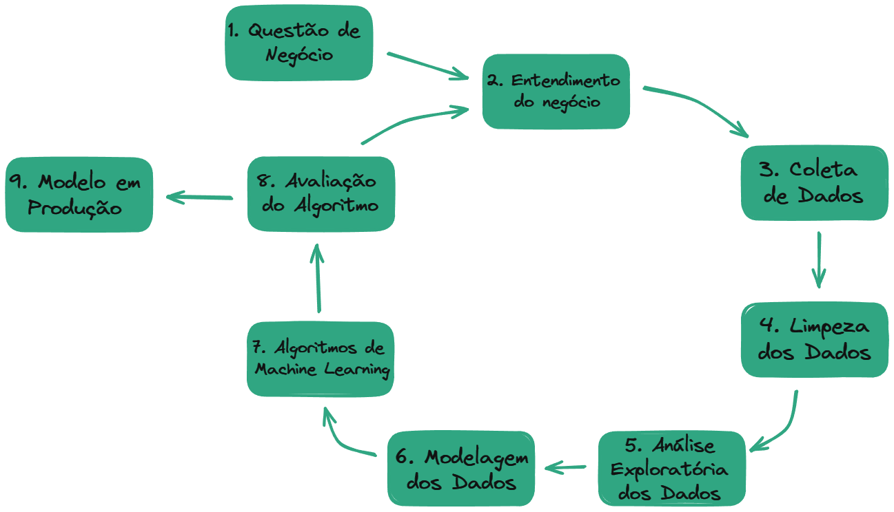
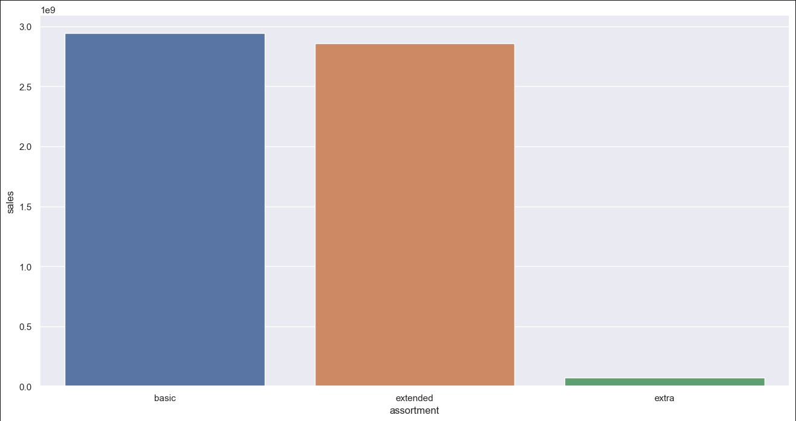
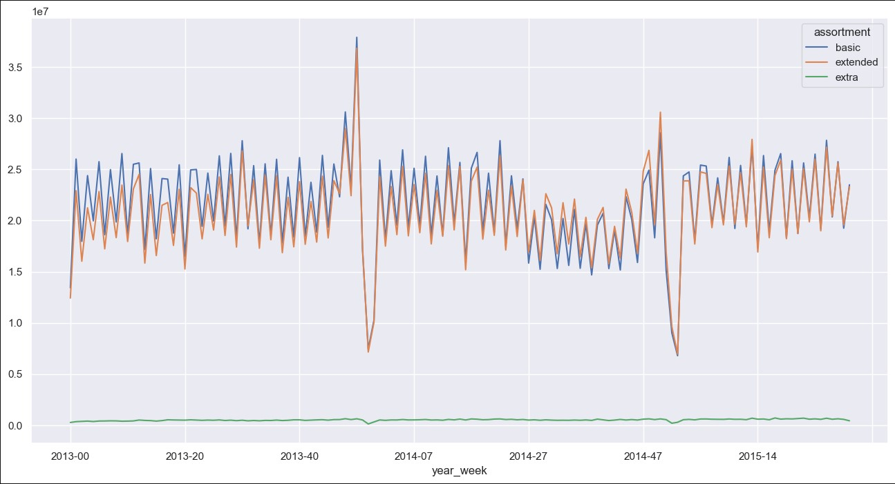
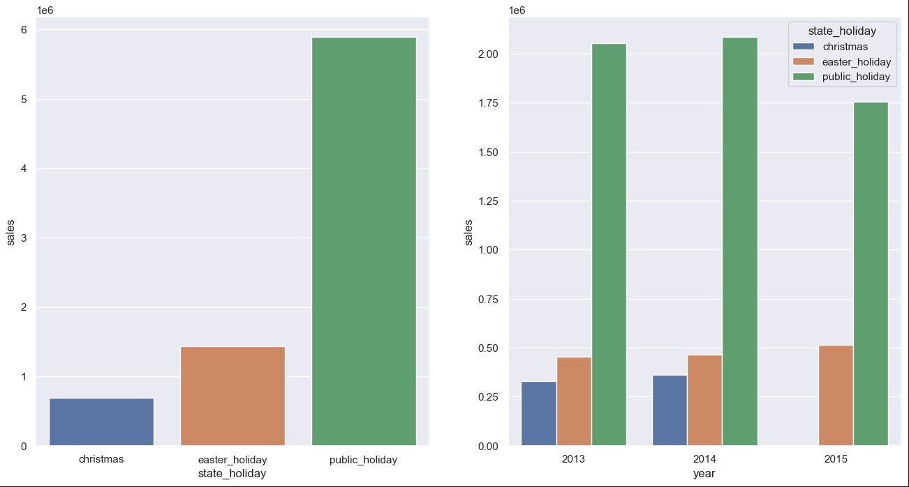
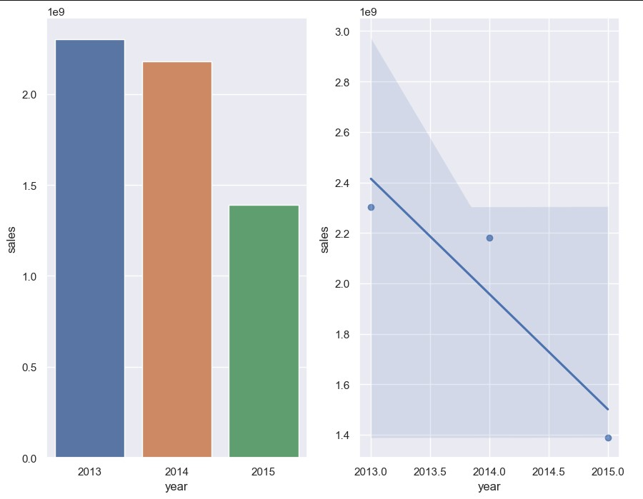
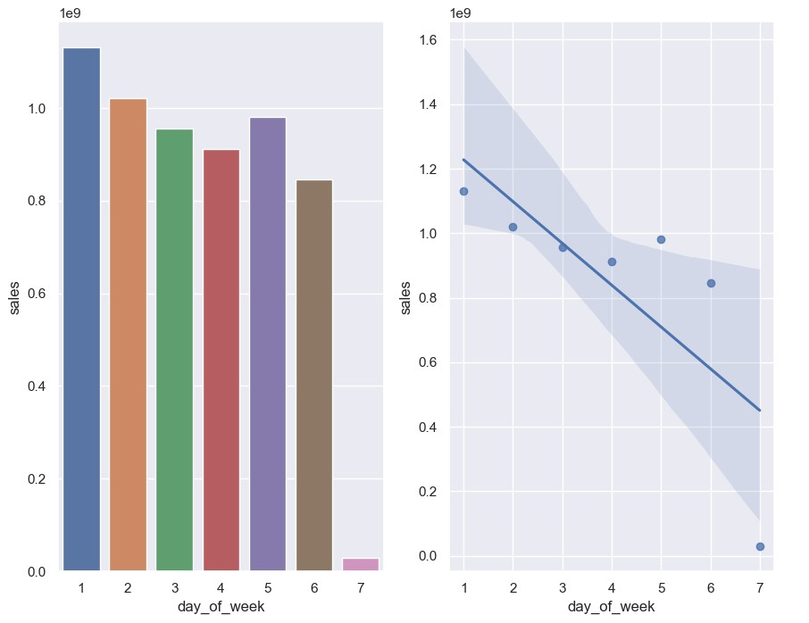
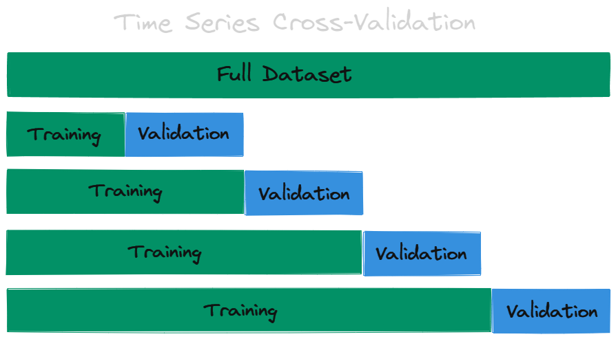
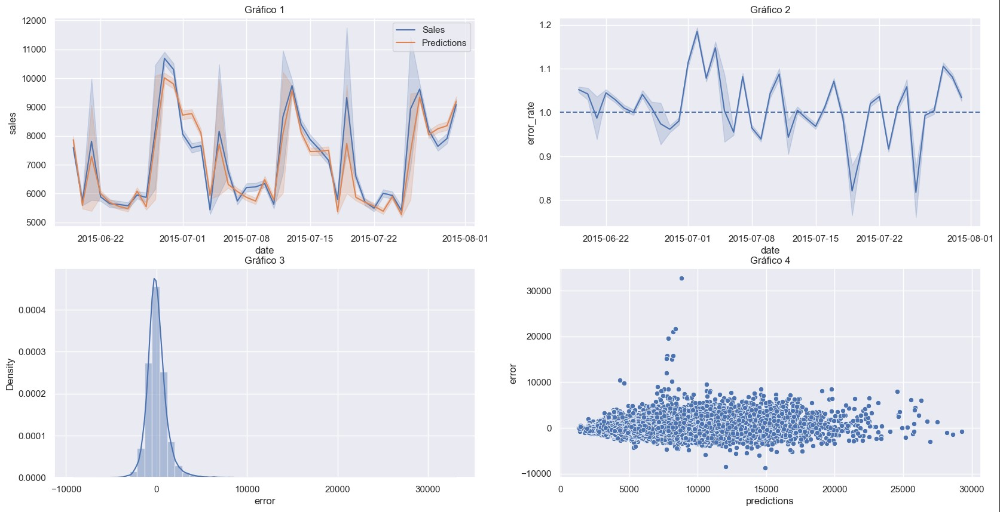
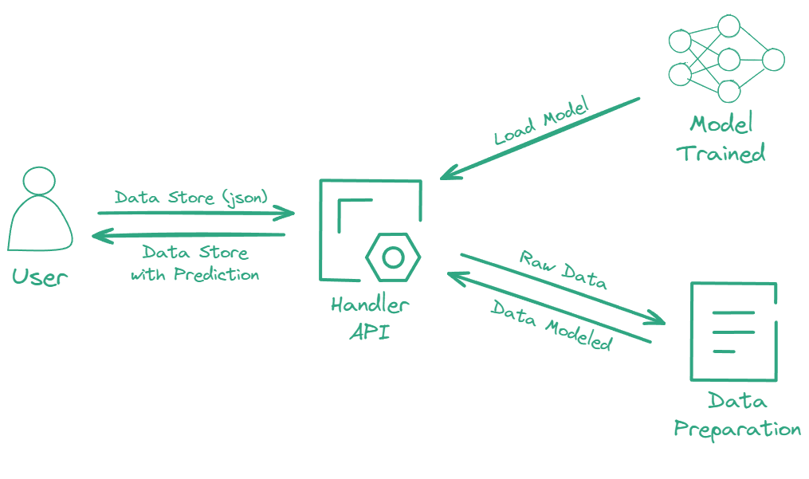
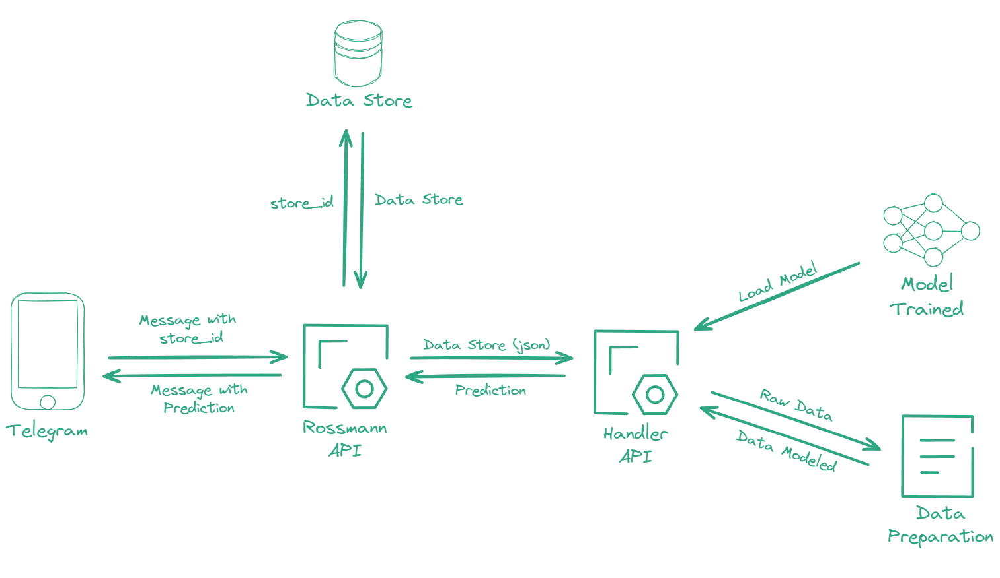

# Rossmann Sales Forecast

<div align="center">

</div>

</br>

# Problema de Negócio

<p>O CFO (Chief Financial Officer) do Grupo Rossmann pretende fazer uma reforma em todas as unidades da rede, tendo com base de investimento, o respectivo faturamento de cada loja.</p> 
<p></p>Afim de dar inicio as reformas, o CFO solicitou que fizessemos uma previsão do faturamento de cada unidade do Grupo Rossmann nas próximas 6 semanas, com objetivo de ter uma maior previsibilidade do faturamento de cada loja e com isso alocar o investimento de forma mais eficiente.</p>

</br>

# Planejamento da solução (estrategia de solução)

A estratégia de solução adotada neste projeto foi o método CRISP-DM (*Cross Industry Standard Process for Data Mining*), que consiste em uma metodologia cíclica e flexível voltada para resolução de problemas que envolvem um grande volume de dados.
Segue abaixo uma ilustração das etapas do processo:

<div align="center">

</div>

</br>

## **1 - Questão de negócio**

Através do contato com o time de negócio, foi entendido que o problema apresentado está em prever o faturamento de todas as unidades do Grupo Rossmann para as próximas 6 semanas, com isso o time de negócio solicitou o projeto que faça essa previsão dos respectivos faturamentos.

</br>

## **2 - Entendimento do negócio**

Em busca de entender melhor a motivação que gerou esse problema, entramos em contato com o CFO e o mesmo disse que deseja alocar uma parte do faturamento de cada unidade para reforma das respectivas unidades.

</br>

## **3 - Coleta de Dados**

<p>Para este cenário fícticio, usamos um conjunto de dados públicos no formato .csv de uma competição do Kaggle.</p>
Você pode acessar a fonte de dados <a href="https://www.example.com">clicando aqui</a></p>

</br>

## **4 - Limpeza dos Dados**

Após a coleta dos dados, inicia-se o processo de limpeza dos dados:

1. **_Descrição dos dados_**: <p>Foi realizado a checagem das variáveis disponíveis e modificados para um melhor manuseio. Foi renomeado o nome das colunas e alterado o tipo das variáveis que necessitavam alteração.</p></br>
2. **_Tratamento dos valores nulos/vazios_**: <p>Foram adotadas algumas premissas para o preenchimento dos valores nulos. Algumas variáveis que deveriam ter um valor correspondente a alguma data e estavam vazias, foi utilizado a data da venda daquela loja e extraindo apenas o valor que precisa: ou dia, ou mês, ou ano. Para a variável “PromoInterval” teve um tratamento diferente, foi dado o valor de “0” para substituir os valores vazios, após isso, foi criado uma variável “month_map” extraindo o mês da data da venda daquela loja especifica e com isso, foi criado a variável “is_promo” onde verifica se o respectivo valor de “month_map” contém na variável “PromoInterval”, se conter, receberá o valor “1” que indica que participou da promoção, se não conter, receberá o valor “0” que indica que não participou da promoção.</p></br>
3. **_Feature Engineering_**: <p>Esta etapa tem o objetivo de facilitar a etapa futura de análise exploratória de dados, deixando as variáveis mais explicitas e de fácil acesso. Foram criadas novas variáveis derivadas de variáveis existentes, exemplo: o ano derivado da data. Algumas variáveis receberam seus respectivos valores com base na descrição dada pela empresa, exemplo: o “Assortment” que tem seus valores como “a = basic”, “b = extra”, “c = extended”.</p></br>
4. **_Filtragem das Variáveis_**: <p>Foi realizado uma filtragem das variáveis que não seriam aproveitadas durante todo o projeto, por exemplo: os dias que as lojas estavam fechada. Também foi feito uma filtragem nas colunas, retirando as colunas que não seriam relevantes, por exemplo: a coluna “Customers” que indica a quantidade de clientes que visitou a loja naquele dia, as colunas “month_map” e “PromoInterval” que foram úteis para gerar uma nova coluna (”is_promo”) e não terão mais utilidade futura.</p></br>

## **5 - Análise Exploratória dos Dados**

Buscando entender melhor como as variáveis impactam diretamente as vendas e qual impacto gera, o time de negócio apresentou uma lista de hipóteses a serem colocadas a prova pelos cientistas de dados.

Abaixo segue algumas das hipóteses e seus respectivos resultados:

### H1. **Lojas com maior sortimentos deveriam vender mais.**
- ***Falsa -*** Lojas com Maior Sortimento vendem menos.

<div align="center">
 
</div>

</br>

### H7. **Lojas abertas durante o feriado de natal deveriam vender mais.**
- ***Falsa* -** Lojas abertas durante natal vendem menos.

<div align="center">
 
</div>

</br>

### H8. **Lojas deveriam vender mais ao longo dos anos.**
- ***Falsa -*** Lojas vendem menos ao longo dos anos.

<div align="center">
 
</div>

</br>

### H11. **Lojas deveriam vender menos aos finais de semana.**
- ***Verdadeira*** - Lojas vendem menos aos finais de semana.

<div align="center">
 
</div>

</br>

## **6 - Modelagem dos Dados**

Nesta etapa do processo é realizado a preparação dos dados para a aplicação futura de algoritmos de Machine Learning. Tendo em vista que o aprendizado dos algoritmos de Machine Learning é facilitado quando os dados numéricos estão na mesma escala. Com isso, foram aplicados técnicas de  Rescaling, Transformation e Enconding

</br>

### 6.1 - **Variáveis numéricas**: 
Buscando deixar todas as variáveis numéricas dentro da mesma escala, foi usado a técnica de Rescaling. Dentro da técnica de Rescaling, foi adotado a utilização do RobustScaler para variáveis que possuíam outliers muito fortes e foi adotado o MinMaxScaler para as demais variáveis.
- RobustScaler - consiste em (valor da variável - Q1) / (Q3-Q1)
  - Q1 → Primeiro Quartil 
  - Q3 → Terceiro Quartil

- MinMaxScaler - consiste em (Valor da variável - Média da Variável) / (Máx. Variável - Min. Variável)

</br>

### 6.2 -  **Variáveis categóricas**: 
Essas variáveis tiveram que ser transformadas em variáveis numéricas para facilitar o aprendizado de Machine Learning. 

- Na variável “state_holiday” foi usado a técnica *One Hot Enconding*, que consiste em transformar os valores categóricos da variável em uma representação binária. Cria-se colunas com respectivos valores categóricos e onde aquele valor estiver contigo, recebe “1” e onde não está contido recebe “0”.</p>
- Na variável “store_type” foi usado a técnica *Label Enconding*, que consiste em atribuir um valor numérico respectivo ao valor categórico da variável. Exemplo: a = 2, b = 5 e c = 7.</p>
- Na variável “assortment” foi usado a técnica *Ordinal Enconding*, que consistem em definir uma ordem de acordo com os valores categóricos da variável. Exemplo: Janeiro = 1, Fevereiro = 2, Março = 3.</p>

</br>

### 6.3 - **Transformação de grandeza**: 
Como a variável resposta (”sales”) encontra-se fora de distribuição normal, foi usado a transformação logarítimica com a finalidade de facilitar o futuro aprendizado de Machine Learning.

</br>

### 6.4 - **Transformação de natureza**: 
Afim de respeitar a natureza cíclica das variáveis temporais, como: dia, dia da semana, semana e mês, foi aplicado um tipo de transformação de seno e cosseno. Sem a transformação de seno e cosseno, a natureza cíclica fica de forma linear, com isso, por exemplo o mês de Dezembro fica distante do mês de Janeiro. Com a transformação de seno e cosseno a natureza cíclica é mapeada em coordenadas, preservando a relação de proximidade entre os pontos no ciclo original.

</br>

### 6.5 - **Seleção de Features**: 
Por fim, utilizamos o algoritmo Boruta para identificar as variáveis mais relevantes para o modelo, para então serem aplicadas no aprendizado de Machine Learning.

Dessa forma, o algoritmo eliminou as seguintes variáveis:

```
 'is_promo',
 'school_holiday',
 'state_holiday_christmas',
 'state_holiday_easter_holiday',
 'state_holiday_public_holiday',
 'state_holiday_regular_day',
 'year'
```

</br>

## **7 - Algoritmos de Machine Learning**

### 7.1 - *Premissas*

Seguindo a questão de negócio apresentada, temos então um problema de Regressão, que refere-se a um tipo de tarefa em que o objetivo é prever um valor com base nos dados de entrada.

Visando a solução do problema, foram testados 4 tipos diferentes de algoritmo de Machine Learning, o que obteve a melhor performance foi selecionado para o modelo.

Tendo em vista que ainda não sabíamos se a natureza do fenômeno de venda era linear ou não, foram escolhidos 2 algoritmos lineares e 2 algoritmos não lineares para realizar os testes.

Os 4 algoritmos escolhidos para realizar o teste, foram:

- Modelos lineares
    - Linear Regression Model
    - Linear Regression Regularized Model (Lasso)
    
- Modelos não lineares
    - Random Forest Regressos
    - XGBoost Regressor

</br>

### 7.2 - *Time Series Cross-Validation*

Os respectivos algoritmos foram avaliados de acordo com técnica de Cross-Validation, que consiste em separar o conjunto inteiro de dados em conjunto de treinamento e conjunto de validação, afim de ter uma melhor avaliação usando diferentes tipos de dados.

A imagem a seguir, ilustra de forma mais clara a separação do conjunto de dados:

<div align="center">

</div>

- A primeira iteração é usado um conjunto menor de dados para treinamento e depois aplicado a validação em uma outra parte do conjunto de dados.
- Na segunda iteração, o conjunto de dados de treinamento aumenta seu tamanho, pois o conjunto anterior de validação passa a integrar o conjunto atual de treinamento.
- Segue esse padrão de separação dos conjuntos de dados, sempre respeitando a ordem cronológica dos dados. Até que use todo o conjunto de dados.

Essa técnica permite avaliar o algoritmo sempre com um conjunto de dado não visto anteriormente, dessa forma é possível avaliar de forma precisa a performance do algoritmo.

</br>

### 7.3 - *Performance dos Algoritmos*

Após a aplicação da técnica de Cross-Validation nos algoritmos escolhidos, tivemos os seguintes resultados:

<div align="center">

|                              Model |             MAE |            MAPE |             RMSE |
| --- | --- | --- | --- |
| Linear Regression |  2077.46 +/- 291.09 |       0.3 +/- 0.02 |  2946.64 +/- 461.11 |
| Linear Regression Regularized Model - Lasso |    2116.2 +/- 341.42 |     0.29 +/- 0.01 |  3057.83 +/- 503.68 |
| Random Forest Regressor |    847.53 +/- 222.78 |     0.12 +/- 0.02 |  1276.74 +/- 327.18 |
| XGBoost Regressor |  1057.23 +/- 140.85 |     0.15 +/- 0.01 |  1505.67 +/- 202.45 |

</div>

Embora o algoritmo Random Forest Regressor tenha obtido uma melhor performance, o algoritmo escolhido para dar continuidade no projeto foi o XGBoost Regressor. 

Ele é um pouco semelhante ao Random Forest Regressor, só que ele é mais enxuto, atribuindo pesos às instâncias com base em seus erros residuais e também as árvores são treinadas sequencialmente, onde cada nova árvore tenta corrigir os erros residuais do conjunto anterior.

</br>

## 8 - Avaliação do algoritmo

### 8.1 - *Performance do Negócio*

Com o algoritmo definido, agora podemos analisar a performance do modelo sobre o ponto de vista de negócio.

Com base nos erros do algoritmo, agora é possível mensurar o faturamento levando em consideração um cenário otimista e um cenário pessimista de cada loja, agregando mais valor na decisão do time de negócio.

Segue abaixo cenários de 5 lojas escolhidas de forma aleatória. 

<div align="center">

|     Loja |       Predição |  Melhor Cenário |    Pior Cenário |        MAE |  MAPE |
| --- | --- | --- | --- | --- | --- |
|     944 |   R$249,159.16 |   R$250,096.42 |   R$248,221.90 |     R$937.26 |    0.13 |
|     287 |   R$304,551.50 |   R$305,115.70 |   R$303,987.30 |     R$564.20 |    0.07 |
|     753 |   R$300,676.44 |   R$301,491.28 |   R$299,861.60 |     R$814.84 |    0.11 |
|    1037 |   R$253,527.95 |   R$254,334.63 |   R$252,721.28 |     R$806.67 |    0.14 |
|     346 |   R$264,539.69 |   R$265,135.40 |   R$263,943.97 |     R$595.72 |    0.08 |

</div>

</br>

### 8.2 - *Performance do Modelo*

Nos gráficos abaixo, é possível analisar a performance geral do modelo e do tamanho dos seus erros.

- Gráfico 1 - compara os valores de vendas com as predições ao longo das últimas 6 semanas e uma sombra que indica a margem de erro.
- Gráfico 2 - indica o erro das predições, onde valor de predição é dividido pelo respectivo valor de venda. (predição/venda).
    - Com base nesse cálculo é possível ter 3 interpretações, são elas:
        - Sendo 1 como predição perfeita, valores das predições é igual aos valores das vendas.
        - Abaixo de 1 há uma subestimação por parte do modelo, valores de predições maiores do que os valores das vendas.
        - Acima de 1 há uma superestimação por parte do modelo, valor das predições menores do que os valores das vendas.
- Gráfico 3 - indica a distribuição do erro, na qual é possível ver que temos uma distribuição normal (próxima da Gaussiana).
- Gráfico 4 - este gráfico separa os erros de acordo com os valores previstos, quanto mais próximo do eixo 0, mais acurácia o modelo tem.

Os gráficos 3 e 4 são mais utilizados para estudos de resíduos, onde é possível ver os pontos fracos do modelo e melhorar a acurácia do mesmo (nesse primeiro momento do projeto, ainda não foi abordado essa análise de resíduo)

<div align="center">

</div>

</br>

## **9 -  Modelo em Produção**

Agora que já definimos o modelo a ser utilizado, treinamos e avaliamos a sua performance, é hora de por o modelo em produção. Para ter uma acessibilidade melhor as predições do projeto, optamos em disponibilizar as informações de forma online através de um APP de mensagens, chamado Telegram.

Nele o usuário deverá enviar uma mensagem para o BOT informando o código da loja que ele deseja obter as previsões de vendas nas próximas 6 semanas, após a solicitação o BOT retornará a mensagem com a respectiva previsão da loja informada.

Para por esse sistema em operação, foi necessário a criação de duas API’s, serão mais detalhadas nos tópicos seguintes.

Para o funcionamento de uma dessas API’s, será necessário a criação de uma *classe* (no notebook está como *Rossmann Class*) que permitirá automatizar todo o processo de limpeza dos dados, filtragem das variáveis, preparação dos dados e por fim a predição.

Para hostear as aplicações, utilizamos o WebService do Render. 

</br>

### 9.1 - *API de Consulta das Previsões (handler.py)*

Afim de obter as previsões, é necessário uma API que contém os dados para realizar essa operação, por exemplo: as lojas, valores de vendas, dia, etc.

Além desses dados, a API também carrega o modelo treinado, faz o tratamento geral dos dados (limpeza, rescaling, etc.) e depois retorna o valor final da predição.

Como resposta da consulta, é retornado o mesmo conjunto de dados de entrada da API no formato *json*, com a inclusão da coluna que informa o valor da respectiva previsão.

Abaixo, segue uma ilustração com intuito de explicar melhor o processo que envolve esta API:

<div align="center">

</div>

</br>

### 9.2 - *API de Mensagens no Telegram (rossmann-bot.py)*

Uma vez que o usuário informa o código da loja que ele deseja saber a previsão das vendas, a API (*rossmann_bot.py*) carrega os dados de atributos da loja que informada pelo usuário, realiza alguns tratamentos nesses dados, converte para o formato *json* e consulta a API anterior (*handler.py*)

Depois que a API de consulta (*handler.py*) é acionada, ela retorna um arquivo *json* com os dados de entrada contendo a previsão de cada uma das lojas. Para finalizar,  a API do *bot* (*rossmann_bot.py)* transforma esse *json*, soma todas as predições referentes aquela loja que o usuário solicitou e informa ao usuário através de uma mensagem, o valor total das previsões de vendas para as próximas 6 semanas.

Abaixo, segue uma ilustração com a finalidade de explicar melhor o processo que envolve esta API:

<div align="center">

</div>

</br>

### 9.3 - *Bot do Telegram*

A seguir é mostrado com vídeo o funcionamento do BOT. Você pode acessar o BOT através do link [Telegram-BOT](https://web.telegram.org/k/#@project_rossmann_bot)

-Lembre-se de usar “/” antes do ID da loja.

<div align="center">

</div>
